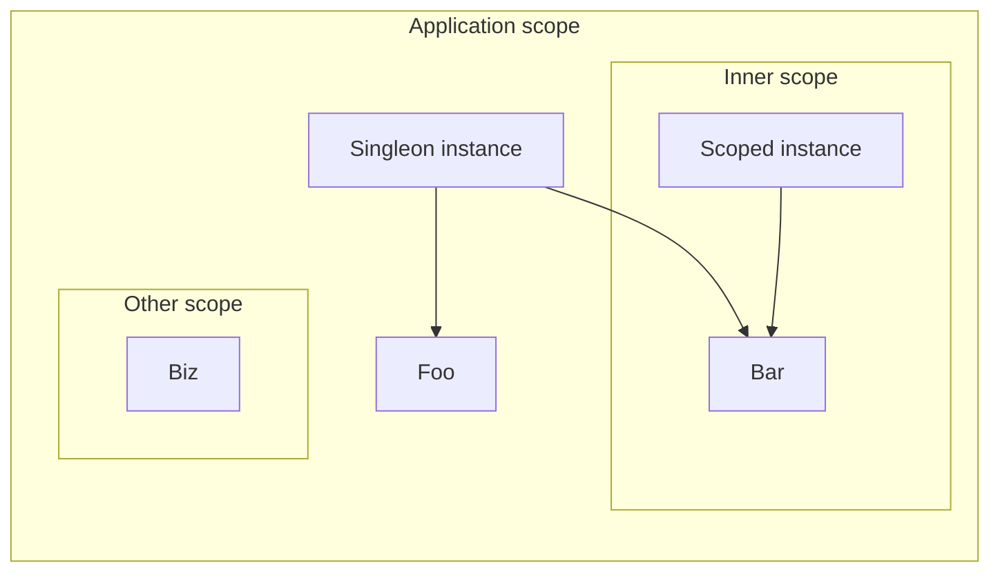

Hi mom, I'm writing a blog!

It's been a while I wanted to share my thoughts on how to write software, especially around architecture and design patterns, but I never knew where to start.

This is the first post of a series covering game development and code architecture. We'll start from the basics: [Dependency Injection](https://en.wikipedia.org/wiki/Dependency_injection)

# What is dependency injection?

From Wikipedia:

> In software engineering, dependency injection is a design pattern in which an object or function receives other objects or functions that it depends on.

What does this mean? In short, it means classes shouldn't know how to initialize other classes they might depend on.

I think this is simpler to explain with an example, let's assume we have two classes, `Foo` and `Bar`:

```java
class Foo {
    Bar bar;

    void helloWorld() {
        bar.greet();
    }
}

class Bar {
    void greet() {
        System.out.println("Hello, world!");
    }
}
```

We say `Foo` _depends_ on `Bar` as it uses it inside its implementation.

## The problem: where does `Bar` come from?

From the example above is clear that `Foo` requires `Bar`, it is not so clear on _how_ it will receive an instance of it. One possible solution could be:

```java
class Foo {
    Bar bar = new Bar();
    // ..
}

void somewhereElse() {
    Foo foo = new Foo();
}
```

This works, but has the side effect of tying `Foo` and `Bar` together. `Foo` now decides which `Bar` instance (always a new one) to use. Can we do better?

```java
class Foo {
    Bar bar;

    Foo(Bar bar) {
        this.bar = bar;
    }
}

void somewhereElse() {
    Foo foo = new Foo(new Bar());
}
```

By addig `Bar` to `Foo`'s constructor parameters, we explicitly declare it as a dependency, and move the decision on which instance it receives outside of the class. This is the core of what dependency injection is about.

## Why do we care?

# Dependency injection concepts

## @Scope



## @Qualifier

Aka names

## Provider

Aka Factory
