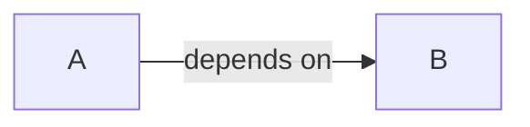

[libgdx-java-base](https://github.com/fourlastor/libgdx-java-base) is my GitHub starter template for [LibGDX](https://libgdx.com/) games. This is a series of posts looking at the project architecture.

This is the first post of the series, and I'll go over my dependency injection strategy.

## Common grounds

A class `A` **depends** on another class `B` when it relies on `B` to provide its functionality.

If `A` depends on `B`, `B` is a _dependency_ of `A`.

A dependency is _injected_ when its initialization happens **outside** the class depending on it.

In our example, `B` is injected in `A` if it's initialized outside of it:

```java
class B {}

class A {
    // a dependency
    private final B notInjected = new B();
    // an injected dependency
    private final B injected;
    
    A(B injected) {
        this.injected = injected;
    }
}
```

Dependency relations define a _dependency graph_: a directed graph where the vertexes are classes, and the edges represent a dependency from class A to class B.



## Dagger

libgdx-java-starter leverages [Dagger](https://dagger.dev/) to instantiate most classes in the project.

> Dagger is a fully static, compile-time [dependency injection](http://en.wikipedia.org/wiki/Dependency_injection) framework for Java, Kotlin, and Android.

Dagger will take a codebase in input, and generate a dependency graph. It will then use this graph to generate code capable of instantiating the classes in the codebase.

Dagger follows the [javax](https://javax-inject.github.io/javax-inject/api/javax/inject/package-summary.html) specification for understanding the dependency graph. In short, this means that, if a class constructor is annotated with `@Inject`, Dagger will be able to instantiate such class.

## Components, where it all starts

Let's look at a simple example:

```java
public class Dependency {

    @Inject public Dependency() {}
}

public class GdxGame extends Game {

    private final Dependency dependency;

    @Inject public GdxGame(Dependency dependency) {
        this.dependency = dependency;
    }
}
```

Dagger knows how to provide `Dependency` to `GdxGame`, but how do we obtain a reference to start up the whole project? We would need some sort of entry point.

In Dagger these entry points are called _components_, and are defined in code by the `@Component` annotation.

```java
@Component
public interface GameComponent {
    GdxGame game();
}
```

Dagger will generate the class `DaggerGameComponent`, implementing `GameComponent`. Since `GdxGame` has an annotated constructor, the method `game()` will return a new instance of it using said constructor, and will create a `Dependency` instance to pass to the constructor.

I usually avoid exposing Dagger-specific classes, and create static factory methods to access them: 

```java
@Component
public interface GameComponent {
    GdxGame game();

    static GameComponent component() {
        return DaggerGameComponent.create();
    }
}

public class GdxGame extends Game {
    @Inject public GdxGame() {}

    public static GdxGame create() {
        return GameComponent.create().game();
    }
}

public class DesktopLauncher {

    public static void main(String[] arg) {
        GdxGame game = GdxGame.create();
        Lwjgl3ApplicationConfiguration config = new Lwjgl3ApplicationConfiguration();
        // ... setup config
        new Lwjgl3Application(game, config);
    }
}
```

## How many games are enough games? A tale of singletons

Usually, we want only **one** instance of `GdxGame` to be available at all times, even if we require it again. Dagger has a `@Singleton` annotation meant for this use:

```java
@Singleton
class GdxGame extends Game { /* ... */ }
```

There's another change we need to make, we need to add `@Singleton` to our component as well:

```java
@Singleton
@Component
public interface GameComponent { /* ... */ }
```

`@Singleton` is a _scope_, a scope ties the lifecycle of a class instance to the lifecycle of the component annotated with it.

In our example, `GameComponent` represents the whole application, so there will always be only one instance of classes annotated with `@Singleton`.

## Modules and building bridges

Dagger requires an annotation to be present for a dependency to be included in the graph, and this requires to be able to **edit** such class. This works as long as the class is part of the project, and so we can add the annotation to it, how do we include a class coming from a library?

We can use _modules_ to solve this. Similar to components, modules are defined in code by the `@Module` annotation. Every method within a module annotated with `@Provides`, will be included in the dependency graph.

```java
@Module
public class GdxModule {

    @Provides
    @Singleton
    public InputMultiplexer inputMultiplexer() {
        return new InputMultiplexer();
    }
}

@Singleton
public class GdxGame {
    
    private final InputMultiplexer multiplexer;
    
    @Inject public GdxGame(InputMultiplexer multiplexer) {
        this.multiplexer = multiplexer;
    }

    @Override
    public void create() {
        Gdx.input.setInputProcessor(multiplexer);
    }
}

public class GameScreen extends ScreenAdapter {

    private final InputMultiplexer multiplexer;
    private final Stage stage = new Stage();

    @Inject public GameScreen(InputMultiplexer multiplexer) {
        this.multiplexer = multiplexer;
    }

    @Override
    public void show() {
        multiplexer.addProcessor(stage);
    }
    @Override
    public void hide() {
        multiplexer.removeProcessor(stage);
    }
}
```
